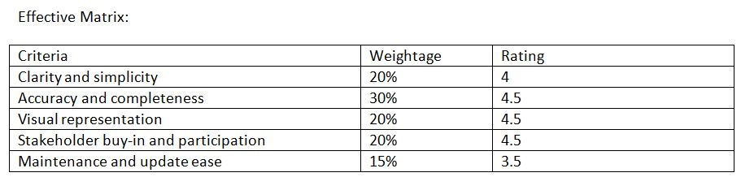

Preparing process flow diagram is an expert’s job and has to be done very carefully. Here is a detailed process, its pros and cons, effective matrix, 
and teams involved while preparing a process flow diagram for a process automation project :

###### Sample assignment Process : 
Preparing a Process Flow Diagram for a Process Automation Project

###### Step 1: Define the Process Boundaries
-	Identify the specific process to be automated
-	Determine the start and end points of the process
-	Define the inputs and outputs of the process
	
###### Step 2: Gather Information and Data
-	Conduct stakeholder interviews to gather information about the process
-	Review existing process documentation and data
-	Observe the process in action to identify key steps and activities
	
###### Step 3: Identify Process Steps and Activities
-	Break down the process into individual steps and activities
-	Identify the tasks, decisions, and actions involved in each step
-	Determine the sequence of steps and activities
-	
###### Step 4: Create the Process Flow Diagram
-	Use a process mapping tool or software to create the diagram
-	Represent each step and activity with a symbol or shape
-	Use arrows to show the flow of the process
-	Include decision points, loops, and branches as necessary
	
###### Step 5: Review and Refine the Diagram
-	Review the diagram with stakeholders to ensure accuracy and completeness
-	Refine the diagram based on feedback and suggestions
-	Ensure the diagram is clear, concise, and easy to understand

###### Step 6: Finalize the Diagram and Document the Process
-	Finalize the process flow diagram and document the process
-	Include annotations and notes to explain each step and activity
-	Store the diagram and documentation in a shared repository for future reference
	
###### Pros:
-	Helps to clarify and understand the process
-	Identifies inefficiencies and areas for improvement
-	Facilitates communication among team members and stakeholders
-	Provides a visual representation of the process
-	Enables process automation and optimization
	
###### Cons:
-	Can be time-consuming and resource-intensive
-	Requires stakeholder buy-in and participation
-	May not capture all nuances and complexities of the process
-	Can be difficult to maintain and update

To make process flow diagram flawless the  explicit list of care to be taken while preparing a Process Flow Diagram (PFD) for a process automation 
project is as follws :

###### I. Understanding the Process
-	Familiarize yourself with the process: Before creating a PFD, ensure you have a thorough understanding of the process, including its inputs, outputs, 
and all the steps involved.
-	Gather information from various sources : Collect data from operators, maintenance personnel, engineers, and other stakeholders to ensure accuracy and 
completeness.
-	Review existing documentation: Study existing process descriptions, flowcharts, and P&IDs (Piping and Instrumentation Diagrams) to gain a deeper 
understanding of the process.
	
###### II. PFD Structure and Layout
-	Use a standard template or format : Establish a consistent structure and layout for your PFD to ensure clarity and ease of understanding.
-	Keep it simple and concise : Avoid clutter and focus on the essential process steps and information.
-	Use clear and concise labels : Label each process step, instrument, and equipment clearly and concisely.

###### III. Process Steps and Activities
-	Identify and include all process steps : Ensure that all process steps, including manual and automated activities, are included in the PFD.
-	Describe each process step clearly : Provide a brief description of each process step, including any relevant details or conditions.
-	Indicate process step relationships : Show the relationships between process steps, including sequencing, parallel activities, and decision points.

###### IV. Instrumentation and Automation
-	Include all instruments and automation components : Identify and include all instruments, sensors, actuators, and automation components in the PFD.
-	Specify instrument and automation details : Provide details about each instrument and automation component, including its function, type, and tag number.
-	Show instrument and automation connections : Illustrate the connections between instruments, sensors, actuators, and automation components.

###### V. Material and Energy Flows
-	Show material flows : Illustrate the flow of materials, including inputs, outputs, and intermediate products.
-	Indicate energy flows : Show the flow of energy, including utilities, such as electricity, steam, and water.
-	Highlight potential hazards: Identify and highlight potential hazards, such as toxic substances, high temperatures, or explosive environments.

###### VI. Control and Monitoring
-	Indicate control systems and strategies : Show the control systems and strategies used to regulate the process, including feedback loops and 
control algorithms.
-	Specify monitoring and alarm points : Identify monitoring points and alarm conditions to ensure process safety and efficiency.

###### VII. Error Prevention and Quality Control
-	Identify potential error sources : Highlight potential error sources, such as human error, equipment failure, or process deviations.
-	Include quality control checks : Show quality control checks and inspections to ensure process quality and product integrity.

###### VIII. Review and Validate
-	Review the PFD with stakeholders: Review the PFD with operators, maintenance personnel, engineers, and other stakeholders to ensure accuracy and 
completeness.
-	Validate the PFD against actual process data : Validate the PFD against actual process data to ensure it accurately represents the process.

By following these guidelines, you can create a comprehensive and accurate Process Flow Diagram that effectively communicates the process and its 
requirements to all stakeholders involved in the process automation project.

